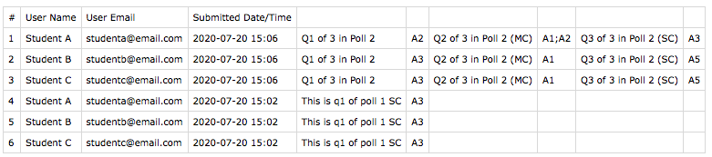
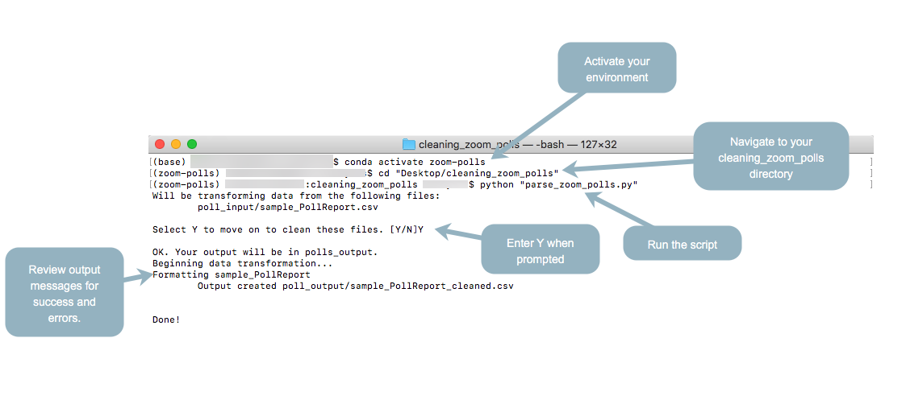
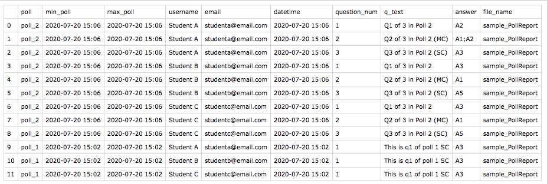

# Example Zoom Poll Input and Output

> ***Follow Along** We have included some follow along prompts that you can use to test the script on our example data. You should already have your environment setup if you would like to follow along.* 

## Example Scenario
There were 2 Zoom polls created/conducted. The first poll had 3 questions, and the second poll had 1 question. Each of the polls ran with the same students only a minute apart. For example sake, each student answered at the same time. 

## Sample Input

> ***FA:** The file [sample_PollReport.csv](example/sample_PollReport.csv) should be placed in the `poll_input` folder.*

The following is from the `file sample_PollReport.csv  `, and is a sample of data similar to what would be downloaded from Zoom, that matches the scenario described above. 

**Take Note**
- Each student has answered all questions in both polls
- `Q2 of 3 in Poll 2 (MC)` is a multiple choice poll question, where more than one choice can be selected. 
  - You can see that Student A selected A1 and A2 (`A1;A2`)
- Zoom polls do not include any headings for the questions/answers (blank columns in the first row)
- The headings of this file are unchanged from Zoom, and it is essential that the headings remain as such for the script to run properly

> ***FA**: Following the instructions in the [README](https://github.com/saud-learning-services/cleaning-zoom-polls#running-the-script), run the script. It should look something like this:*
> 

## Sample Output

> ***FA:** The file [sample_PollReport_cleaned.csv](example/sample_PollReport_cleaned.csv) should be found in the `poll_output` folder if everything ran properly.*

**Take Note**
- Every student now has a row for each poll/question
- There are new columns (added by the script), and name changes for some original columns
- In our example scenario there were 2 polls, the script uses the number of unique question rows to determine how many polls there are

column | description | example notes
---------|---------- |---------- 
 poll | An identifer for which poll the question(s) were a part of. Any polls with multiple questions would have the same poll number (i.e poll_1) | In this scenario, the script adds poll_1 and poll_2 based on the range of submission timestamps, and the unique first questions
 min_poll | The minimum submission date/time for the poll
 max_poll | The maximum submission date/time for the poll 
 username | From the original data, the User Name
 email | From the original data, the Email
 datetime | From the original data, the Submitted Date/Time
 question_num | The question number is assumed from the order of question/answer in the columns | In our scenario, recall one of the polls (poll_2) had 3 questions, the order that these appeared as columns is preserved and used as the question_num
 q_text | The question text
 answer | The student's answer to the question
 file_name | The name of the original file from `poll_input`

